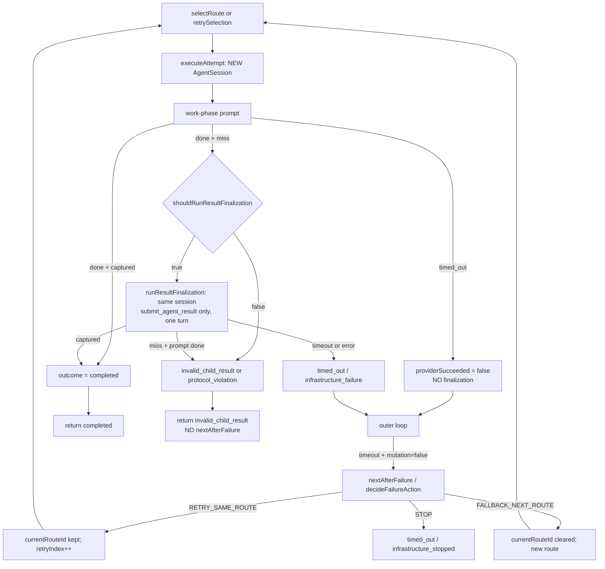

# Worker retry → finalization → fallback boundary forensics

Date: 2026-08-16
Development identity: `0.1.0-rc.29` (local unpublished)
Public RC28 remains immutable.

This document records the control-flow trace, isolated reproduction, and
read-only live evidence for Mission
`mission-0bfe84d8-6848-404b-94b4-81cc1bff502e` Attempt
`attempt-cbfaa8bf-4715-4509-9c8f-6be2b25031dd`. It does not authorize
publication, a live Mission rerun, or a routing-policy change.

Primary classification: **C** — finalization is not skipped after
`RETRY_SAME_ROUTE`; after the bounded capture opportunity the model still
omitted a valid structured result; accepted architecture treats that as
terminal protocol (`invalid_child_result`) returning to Boss, not M4
`FALLBACK_NEXT_ROUTE`.

No runtime source change is authorized from this finding.

## 1. Exact real Attempt timeline

Read-only snapshot of
`~/.pi/agent/pi-multi-orchestrator/mission.sqlite`,
`health.json` generation 11, and `analytics.sqlite`. Live routing and
pool weights were not modified.

### Mission

| Field | Value |
|---|---|
| Mission | `mission-0bfe84d8-6848-404b-94b4-81cc1bff502e` |
| Created | 2026-08-16T05:33:57.688Z |
| Terminal | 2026-08-16T05:36:16.362Z |
| Store status | `awaiting-review` |
| Boss terminal | `AWAITING_USER` |
| Boss route | `ag/gemini-3.7-flash-high` |
| protocolFailures | 0 |
| Cycles | 4 |
| Evidence | 0 |
| Verification runs | 0 |
| Quality decisions | 0 |

### Task

| Field | Value |
|---|---|
| Task | `task-ec717c46-cb36-4d27-9d8d-f10a46d4c11f` |
| executionClass | investigation |
| roleId | investigator |
| Created | 2026-08-16T05:34:03.280Z |
| Final status | `blocked` |
| Quality | `unverified` |

### Canonical Attempt (MissionStore)

MissionStore persists **one** Attempt row for the whole `SubagentExecutor.run`.
The timeout child and the same-route retry child are not separate durable
Attempt rows.

| Field | Value |
|---|---|
| Attempt | `attempt-cbfaa8bf-4715-4509-9c8f-6be2b25031dd` |
| Route | `r9-ninerouter-ocg-deepseek-v4-flash-da31f2fa9acae2b5429e` |
| Remote model | `ocg/deepseek-v4-flash` |
| started_at | 2026-08-16T05:34:03.285Z |
| ended_at | 2026-08-16T05:35:50.014Z |
| Elapsed | ~106.729 s |
| status | failed |
| terminal_state | `invalid_child_result` |
| mutation_observed | 0 |
| result_json | null |

### HealthStore (DeepSeek only; Luna was not selected)

| Field | Value |
|---|---|
| lastFailureAt | 2026-08-16T05:35:03.303Z |
| lastFailureClass | `timeout` |
| lastSuccessAt | 2026-08-16T05:35:49.998Z |
| circuit | healthy |
| consecutiveFailures | 0 |

Luna (`ocg/gpt-5.6-luna`) still shows the earlier 04:59 `transport_error`.
Gemini Boss lastSuccess remains 04:24. Weighted Investigation selected
DeepSeek; no second Investigation route ran.

### Correlated timestamps

| Time (UTC) | Durable fact | Code-path meaning |
|---|---|---|
| 05:33:57.688 | Mission created | Boss start |
| 05:34:03.279 | `boss-plan` cycle 0 `dispatch` | Task created |
| 05:34:03.285 | `task_started` / Attempt start | `execute()` loop iteration 1, new child session |
| 05:35:03.303 | DeepSeek `timeout` | Work phase #1 hit `routing.timeoutMs` 60s; `providerSucceeded=false`; no finalization on that child |
| 05:35:03.303 → 05:35:49.998 | ~46.695 s | Work phase #2 on a **new** same-route session; provider succeeded |
| 05:35:49.998 | `lastSuccessAt` | Outer loop `recordSuccess` **after** `executeAttempt` returned |
| 05:35:50.014 | Attempt `ended_at` / `attempt_failed` | `finishAttempt`; 16 ms after `lastSuccessAt` |
| 05:35:53.520 | Boss evaluate `verification: ["blocked"]` | No Evidence → M7 never started |
| 05:36:16.361 | safety budget exhausted | `AWAITING_USER` |

The 16 ms gap is compatible with in-process health write plus SQLite
`finishAttempt`. It is **not** compatible with an additional provider
inference. If a finalization turn ran, it ran **inside** the ~47 s window
**before** `lastSuccessAt`.

Health write order in `SubagentExecutor.execute` is success then failure.
Live order (failure at 05:35:03, success at 05:35:49, no later failure)
matches: child #1 timeout-only; child #2 `providerSucceeded` with **no**
subsequent infrastructure failure. Therefore finalization did **not**
timeout or throw. Terminal `invalid_child_result` rather than `timed_out`
agrees.

Analytics store event count for this window: **0** (analytics disabled).
Executor per-route attempt lineage (`retryIndex`, `selectionKind`,
`resultFinalization`) was not persisted.

## 2. Retry / finalization code path

Finalization lives **inside** `executeAttempt`, after work-phase
`providerSucceeded`, not in the outer retry loop. Each loop iteration
creates a **fresh** child session (`ChildSessionFactory.create`).



`shouldRunResultFinalization` (`src/core/workers/finalization.ts`):

```text
providerSucceeded && !captured && !cancelled && !safetyTerminated
  && protocolViolation !== true
```

Outer-loop stop that prevented cross-route fallback
(`src/core/workers/executor.ts`):

```text
if (single.outcome === "invalid_child_result" || single.outcome === "protocol_violation")
  return resultBase(..., invalid_child_result, ...)
```

`decideFailureAction` is never consulted for that outcome.
`invalid_child_result` is not an M4 `FailureClassification`. M4
`protocol_error` means provider HTTP/decode failure, not a missing worker
result tool.

Same-route retry after timeout:

```text
maxSameRouteRetries = max(0, routing.maxAttempts - 1)
retryable classes: rate_limited | timeout | transport_error
if retryCount < maxSameRouteRetries → RETRY_SAME_ROUTE
else if fallback.enabled and class not in
  {cancelled, invalid_request, unknown, protocol_error} → FALLBACK_NEXT_ROUTE
else STOP
```

Live `routing.maxAttempts = 3` ⇒ two same-route retries allowed. The first
timeout consumed one; `RETRY_SAME_ROUTE` was the correct M4 action.

## 3. Deterministic reproduction

No live Mission. Fake adapters in
`test/worker-result-finalization.test.ts`.

Sequence:

1. Route A work #1 hangs past `timeoutMs` → `timed_out`, `mutation=false`
2. `failureAction = RETRY_SAME_ROUTE`
3. Route A work #2 succeeds without `submit_agent_result`

Observed **current** behavior (test
`runs finalization after timeout same-route retry when retry work omits the result`):

| Counter | Value |
|---|---|
| workPhaseCount / session creates | 2 |
| routingAction sequence | scheduled timeout → `RETRY_SAME_ROUTE` → retry |
| finalizationAttempted | true on attempt 2 |
| finalizationCount / extra prompts | 1 (total `promptCount` = 3: hang + omit + finalize) |
| resultCaptured | false |
| protocolViolation | false |
| terminal | `invalid_child_result` |
| fallbackCount | 0 |
| routes used | route A only |

Companion test
`completes after timeout same-route retry when retry finalization captures the result`
proves CASE 1 on the same retry path: finalization can still complete the
worker Attempt without fallback.

Harness note: per-session turn counting is required because retry creates a
second handle. Shared global `promptCount` would mis-route the retry work
prompt into the fake finalization branch.

## 4. Whether finalization ran on the live Attempt

### Isolated executor (exact sequence)

**Yes.** After `RETRY_SAME_ROUTE`, a successful work phase with a missing
result enters `shouldRunResultFinalization` and calls
`runResultFinalization`.

### Live durable store

**Cannot independently prove the second prompt.**
`resultFinalization` is in-memory on `SubagentAttempt` /
`SubagentRunResult`. `executeMissionTask` persists
`terminalState`, `mutationObserved`, and `result` only. Analytics did not
record the run. Those diagnostics were lost when the Pi `-p` process
exited.

Do not claim the live finalization turn ran merely because the source says
it should.

### Timing compatibility

- Compatible with finalization having already finished inside the ~47 s
  retry child **or** with finalization having been skipped by an
  in-memory predicate.
- Incompatible with a finalization LLM call in the 16 ms
  `lastSuccessAt` → Attempt-end gap.
- Incompatible with finalization timeout/error: that would
  `recordFailure` after `recordSuccess` and would not leave
  `lastSuccessAt` as the last health write, and the terminal would be
  `timed_out` / infrastructure, not `invalid_child_result`.

The only unobservable skip predicate is work-phase
`protocolViolation === true` (then finalization is skipped and the outer
loop still returns `invalid_child_result`). Investigation omit-without-submit
does not normally set that flag. The known-good direct probe on the same
`ocg/deepseek-v4-flash` route used the omit → one finalization path.

Combined: there is **no executor control-flow bug that skips finalization
after retry**. Live capture failed after provider success. The durable
terminal is `invalid_child_result` with `result_json=null`.

## 5. Protocol result state

| Fact | Value |
|---|---|
| Structured result | absent (`result_json=null`) |
| Evidence admitted | 0 |
| M7 | 0 |
| mutation_observed | false |
| Cross-route fallback | none (`fallbackHistory=[]`, `fallbackCount` not persisted; HealthStore shows only DeepSeek writes) |
| Boss | later cycles replan/evaluate against the same blocked Task; safety budget → `AWAITING_USER` |

If finalization ran and the model omitted the tool again, `readProtocolResult`
returned undefined after `prompt.kind === "done"`, report outcome `missing`,
Attempt outcome `invalid_child_result`. Isolated reproduction of that miss
matches the durable terminal.

## 6. Safe observability gap

`WorkerFinalizationReport` already has metadata-only fields:

- `required`
- `attempted`
- `succeeded`
- `outcome` (`not_required` / `succeeded` / `missing` /
  `protocol_violation` / `infrastructure_failure` / `cancelled` /
  `safety_stop`)
- optional `toolsExposed`, `stopReason`

These are **intentionally in-memory** (ADR-048: do not add a persisted
terminal-state enum). They are **not sufficient** for production diagnosis
of a live Mission after the process exits. This incident cannot answer
“did the second prompt happen?” from the store.

A later metadata-only persist of those fields onto the Attempt or an
analytics event would close the gap without raw completion/transcript
persistence. That is a follow-on idea, not the correction for this
incident. See `docs/IDEAS_BACKLOG.md`.

## 7. Accepted routing semantics

Distinguish three failure families:

| Family | Examples | Accepted owner |
|---|---|---|
| Infrastructure | timeout, auth, transport, quota, unavailable | M4 `decideFailureAction` (retry / fallback / STOP) |
| Quality | valid structured result exists and is unacceptable | M7 / Boss repair; **not** M4 fallback (ADR-007, QE-001) |
| Result-protocol / capability | provider succeeded; no valid structured worker result after the one bounded finalization | `invalid_child_result`; **no** infrastructure health penalty; **no** automatic fallback (WORK-06, FB-005, ADR-048) |

Result-protocol failure **already has** an accepted routing semantic: stop
the worker route chain for this executor run and return control to Boss.
It is not an unspecified hole. Treating it as `FALLBACK_NEXT_ROUTE` would
**extend** routing semantics and requires an ADR. It would also violate
FB-005 if labeled as infrastructure fallback.

M4 `protocol_error` is a different class (provider protocol/decode) and
already STOPs rather than falling back.

## 8. Mutation safety matrix

| Case | Condition | Accepted / current behavior |
|---|---|---|
| 1 | provider success + work-phase result missing + finalization succeeds | `COMPLETED` worker Attempt; Evidence may be admitted; no extra Attempt |
| 2 | provider success + work-phase result missing + finalization fails + `mutation=false` + another compatible route exists | **STOP** `invalid_child_result`; return to Boss; **do not** `FALLBACK_NEXT_ROUTE` |
| 3 | provider success + work-phase result missing + finalization fails + `mutation=true` | `partial_mutation_requires_review`; **MUST NOT** replay side effects on another route |
| Regression | timeout → `RETRY_SAME_ROUTE` → provider success → missing result → finalization miss | Same as CASE 2: `invalid_child_result`, `fallbackCount=0` |

`mutation=false` does not convert protocol miss into infrastructure
fallback under accepted policy. `mutation=true` forbids blind replay even
if a future ADR adds protocol-capability fallback for the non-mutating
case.

## 9. `maxAttempts` semantic finding

ConfigV1 `routing` allowed keys:

`maxAttempts`, `timeoutMs`, `rateLimitCooldownMs`, `quotaCooldownMs`,
`fallback.enabled`, `diversityPreference`.

There is **no** `routing.maxSameRouteRetries` field. The router derives:

```text
maxSameRouteRetries = max(0, policy.maxAttempts - 1)
```

Live generation 60: `maxAttempts=3` ⇒ two same-route retries after the
first try (three total tries on one route for retryable infrastructure
classes).

`maxAttempts` is **not** a total budget across routes. After same-route
retries are exhausted, `FALLBACK_NEXT_ROUTE` is gated by
`fallback.enabled` and remaining eligible routes. Each new fallback route
resets `retryIndex` and may consume its own same-route retry budget.
Pool-entry `maxAttempts` is schema-validated against the safety ceiling
and is **not** read by `decideFailureAction`.

Accepted product meaning of `routing.maxAttempts` in code:

**try the same route up to `maxAttempts` times for retryable
infrastructure failures before considering cross-route fallback.**

The field name can be read as a total-attempt cap; the implementation does
not use it that way. The current model was adequate for this incident
(timeout retried; protocol miss then stopped). Do not add a new field
unless a later authorized design change needs an independent cross-route
budget.

## 10. Primary root cause

**C.** Finalization ran correctly on the retry child in the executor
control flow; the model again omitted a valid structured result; current
routing correctly stops by accepted policy.

Supporting evidence:

- Isolated test of timeout → `RETRY_SAME_ROUTE` → success/omit shows
  `resultFinalization.attempted === true` and `fallbackCount === 0`.
- That **rules out A** (skip after retry due to executor control-flow bug).
- Retry creates a new `AgentSession`, so **B** (same-session contamination
  from the timed-out child) is not a code path. Same-session finalization
  on the retry child is the known-good ADR-048 path.
- WORK-06 / ADR-048 / FB-005 / ADR-007 define protocol miss as terminal
  for M4, not as infrastructure fallback. **D** would be a new policy, not
  a missing spec.

Live store cannot prove the second prompt; that is an observability gap
under C, not a different root cause.

## 11. Recommended single correction

**None in runtime.** Classification C forbids a speculative A/B/D patch.

Follow-ons that are **not** this mission:

- Metadata-only persist of `resultFinalization` (observability).
- An ADR for non-mutating result-capability fallback only if product
  intent changes (would be D, not C).

The next real Mission remains separately authorized.
